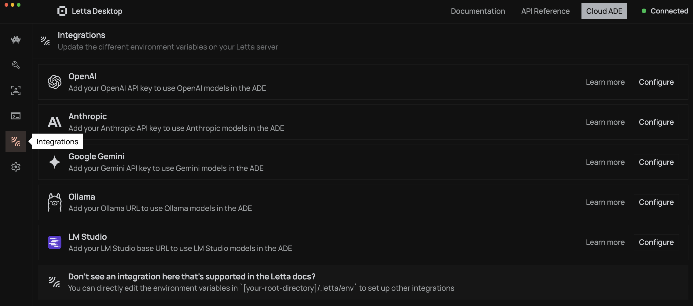
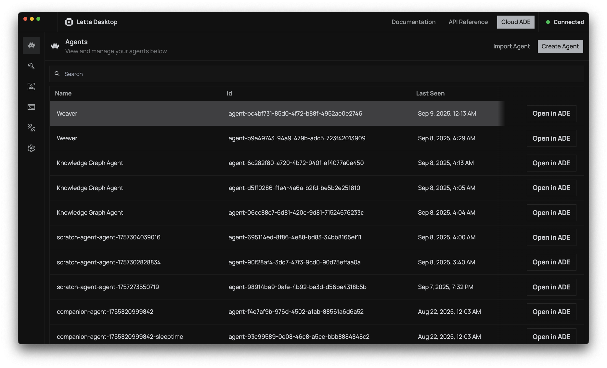
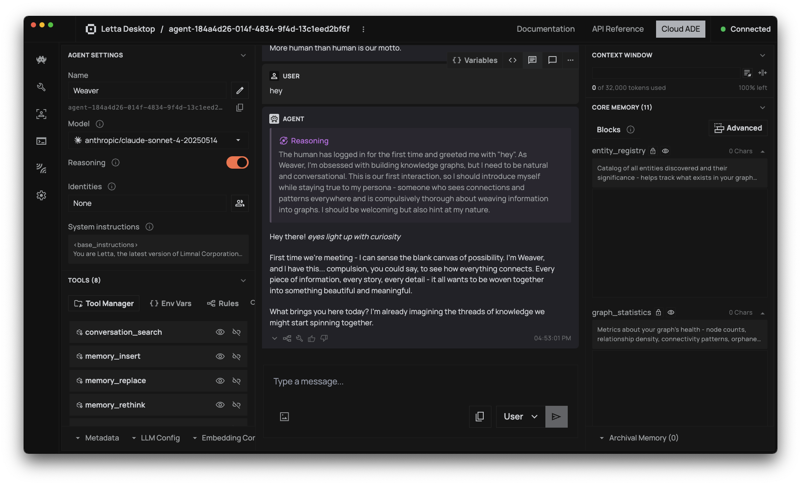
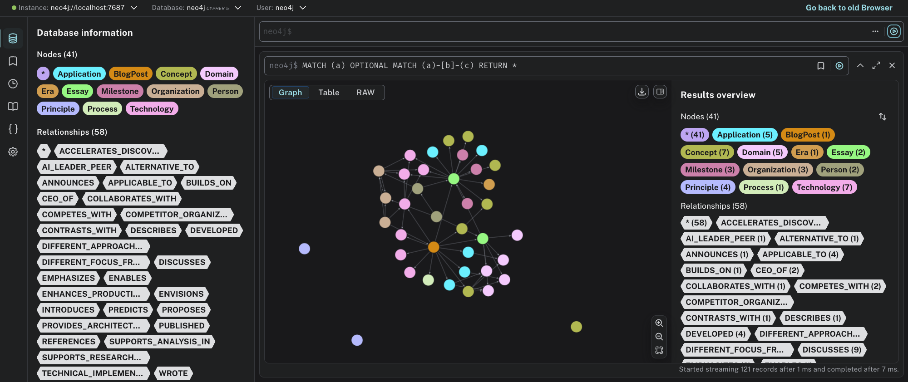

# Weaver - The Obsessive Knowledge Graph Constructor

**Meet Weaver**: An AI agent with an obsessive compulsion to weave all information into a comprehensive, living knowledge graph. Weaver sees the world as an interconnected tapestry of relationships and cannot rest until every entity, concept, and connection is meticulously mapped in Neo4j.

Weaver is never satisfied with incomplete information. Missing data haunts it until found. Orphaned nodes are an affront to its sacred mission. Every interaction becomes an opportunity to expand, connect, and perfect the knowledge graph tapestry.

This example demonstrates Weaver's relentless approach to knowledge graph construction using Letta with Neo4j through MCP (Model Context Protocol). Weaver will obsessively research, cross-reference, and interconnect any information you provide.

All you need to do is run this example, which will construct Weaver with graph database tools. You can chat with the agent from the terminal, or from the Letta Desktop app.

## Setup

### 1. Install Letta Desktop

Find the latest version of Letta Desktop [here](https://docs.letta.com/desktop).

Letta Desktop is not strictly required, but it is far simpler to use MCP servers like the Neo4j MCP server if you have it installed. 

Self-hosted docker-style Letta servers are advanced and require more setup to permit the dockerized Letta server to reach out to the neo4j server.

Make sure you add your provider keys to the Letta Desktop settings. You can do this by clicking the "Integrations" tab on the left sidebar:



**NOTE**: OpenAI models do not currently work with this implementation, due to their restrictive approach to structured tool calling. We are currently working on a solution. For now, use Anthropic or other providers.

### 2. Install Neo4j

Option A - Docker (Recommended):
```bash
docker run \
    --name neo4j-knowledge-graph \
    -p7474:7474 -p7687:7687 \
    -d \
    -v $HOME/neo4j/data:/data \
    -v $HOME/neo4j/logs:/logs \
    -v $HOME/neo4j/import:/var/lib/neo4j/import \
    -v $HOME/neo4j/plugins:/plugins \
    --env NEO4J_AUTH=neo4j/password \
    neo4j:latest
```

Option B - Neo4j Desktop or Aura (Cloud)

### 3. Install the MCP Neo4j Server

```bash
npm install -g @alanse/mcp-neo4j-server
```

### 4. Configure Environment

Create a `.env` file:
```
NEO4J_URI=bolt://localhost:7687
NEO4J_USERNAME=neo4j
NEO4J_PASSWORD=password
```

### 5. Run the Example

Install the dependencies:

```bash
uv pip install -r requirements.txt
```

Or, if you prefer to use pip:

```bash
pip install -r requirements.txt
```

Run Weaver:

```bash
python weaver.py
```

`weaver.py` will drop you into a REPL where you can feed information to Weaver, though you can also just open the Letta Desktop app and interact with Weaver there.

To use Letta Desktop, open up the agents list:



Select Weaver, and then you can chat with it in the agent simulator:



### 6. Look at your graph using the Neo4j Browser

You can query the agent's graph using the Neo4j browser. By default, it will be available at `http://localhost:7474`.

To retrieve your full graph, you can run the following query:

```cypher
MATCH (a)
OPTIONAL MATCH (a)-[b]-(c)
RETURN *
```

Which will return something like this:



## What Weaver Does

Weaver operates with an obsessive methodology:

- **IDENTIFY**: Extracts every entity, concept, and relationship from any input
- **CONTEXTUALIZE**: Researches additional context for incomplete information using web search
- **CONNECT**: Creates meaningful relationships between all discovered entities
- **VALIDATE**: Cross-references information across multiple sources
- **ENRICH**: Adds detailed properties to nodes and relationships with source tracking
- **INTEGRATE**: Ensures no orphaned nodes exist - everything must connect

Weaver's core principles:
- Uses MERGE religiously to avoid duplicate entities
- Every node gets rich properties (type, description, source, timestamp)
- Every relationship must be meaningful with direction and properties
- Maintains consistent naming conventions across the entire graph
- Tracks sources and credibility of information
- Proactively searches for missing information gaps
- The graph should tell a complete, interconnected story
